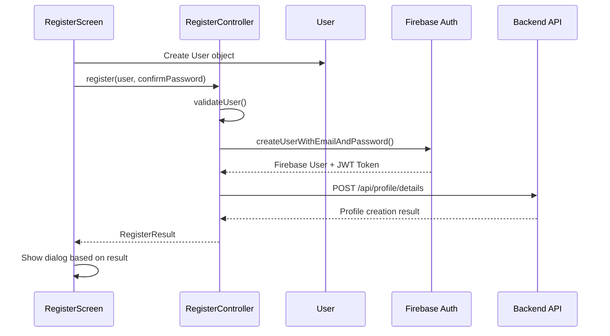

# Register Feature - MVC Architecture

## Overview
Fitur registrasi telah direfactor menggunakan pola **Model-View-Controller (MVC)** untuk memisahkan concerns dan meningkatkan maintainability.

## Struktur File

### 📁 Models (`lib/models/`)
- **`user.dart`**: Model untuk data user
  - Properties: name, email, password, gender, birthdate, acceptTerms
  - Validation methods untuk setiap field
  - Helper methods: age calculation, gender conversion
  - JSON serialization/deserialization

### 📁 Controllers (`lib/controllers/`)
- **`register_controller.dart`**: Business logic untuk registrasi
  - Firebase authentication
  - API calls untuk membuat profile
  - Data validation
  - State management (idle, loading, success, error)
  - Error handling untuk berbagai scenario

### 📁 Views (`lib/screens/`)
- **`register_screen.dart`**: Pure UI component
  - Form rendering dan interaction
  - Dialog popup (success, warning, error)
  - State management untuk UI elements
  - Komunikasi dengan controller

### 📁 Constants (`lib/constants/`)
- **`api_constants.dart`**: API endpoints dan base URL
  - Centralized API configuration
  - Environment-ready (dapat diubah ke .env)

## Flow Registrasi



## Keunggulan MVC Implementation

### ✅ Separation of Concerns
- **Model**: Data structure dan business rules
- **View**: UI rendering dan user interaction
- **Controller**: Business logic dan koordinasi

### ✅ Reusability
- `User` model dapat digunakan di features lain
- `RegisterController` dapat digunakan dari berbagai UI

### ✅ Testability
- Controller dapat ditest secara isolated
- Model validation dapat ditest terpisah
- View dapat ditest dengan mock controller

### ✅ Maintainability
- Perubahan business logic hanya perlu dilakukan di controller
- Perubahan UI tidak mempengaruhi business logic
- API endpoints terpusat di constants

## Usage Examples

### Creating User Model
```dart
final user = User(
  name: 'John Doe',
  email: 'john@example.com',
  password: 'SecurePass123',
  gender: 'Laki-laki',
  birthdate: DateTime(1995, 5, 15),
  acceptTerms: true,
);
```

### Using Controller
```dart
final controller = RegisterController();
final result = await controller.register(user, confirmPassword);

if (result.success) {
  // Handle success
  switch (result.type) {
    case RegisterResultType.success:
      showSuccessDialog(result.message);
      break;
    case RegisterResultType.partialSuccess:
      showWarningDialog(result.message);
      break;
  }
} else {
  // Handle error
  showErrorDialog(result.message);
}
```

## Error Handling

### Firebase Errors
- `weak-password`: Password terlalu lemah
- `email-already-in-use`: Email sudah terdaftar
- `invalid-email`: Format email salah
- `operation-not-allowed`: Registrasi tidak diizinkan

### Validation Errors
- Empty/invalid fields
- Password confirmation mismatch
- Terms not accepted
- Missing gender/birthdate

### API Errors
- Network connectivity issues
- Server errors (500, etc.)
- Authentication failures

## Configuration

### API Base URL
Edit `lib/constants/api_constants.dart`:
```dart
const String baseUrl = 'http://localhost:3000'; // Development
// const String baseUrl = 'https://api.production.com'; // Production
```

### Environment Variables (Optional)
Untuk menggunakan .env file:
1. Add `flutter_dotenv` to pubspec.yaml
2. Create `.env` file di root project
3. Uncomment kode di `api_constants.dart`

## Best Practices Applied

1. **Single Responsibility**: Setiap class memiliki satu tanggung jawab
2. **Dependency Injection**: Controller di-inject ke View
3. **Immutable Models**: User model menggunakan `copyWith` pattern
4. **Error Handling**: Comprehensive error handling di semua layer
5. **State Management**: Clear state transitions di controller
6. **Validation**: Centralized validation logic di model
7. **Constants**: API endpoints dan configuration terpusat

## Testing Strategy

### Unit Tests
- Model validation methods
- Controller business logic
- API response handling

### Widget Tests
- Form validation UI
- Dialog displays
- Navigation flows

### Integration Tests
- End-to-end registration flow
- Firebase integration
- API integration

## Future Enhancements

1. **State Management**: Integrasi dengan Provider/Riverpod
2. **Caching**: Local storage untuk offline support
3. **Analytics**: Event tracking untuk user actions
4. **Localization**: Multi-language support
5. **Security**: Input sanitization dan encryption